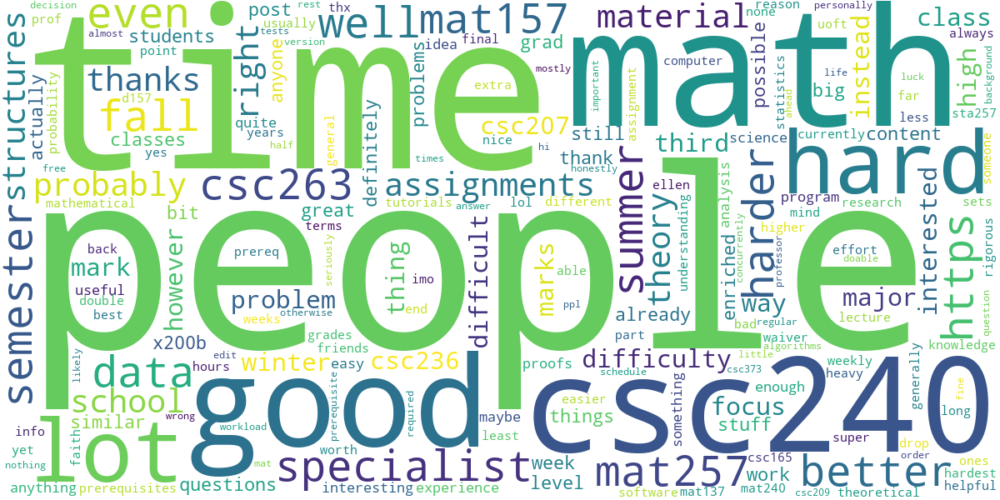

# UofTCourse

This is a side project initialized by Jasmine (Jingyi) Sun and Edward (Haoran) Li. 

This project is started with the mission of helping undergraduate student in University of Toronto to make a better decision when enrolling courses for each semester. Mission is achieved by organizing and analyzing the public data from reddit.com/r/uoft, the subreddit for U of T. The project is presented in a form of [website](http://rateyourcourses.ca), and consists three major parts: web front-end (by Jasmine), web back-end (by Jasmine) and algorithms (by Edward). 

This repository contains:
1. The [algorithm Python file folder](CourseCloudFromReddit) where contains all the Python code to process the raw data from reddit.
2. All the rest files are components of web implementation.

## Table of Contents

- [Background](#background)
- [Algorithm Implementation](#algorithm-implementation)
    - [Algorithm Implementation](#algorithm-implementation)
    - [Raw data from U of T](#raw-data-from-u-of-t)
    - [Raw data from reddit](#raw-data-from-reddit)
    - [Word frequency and word cloud](word-frequency-and-word-cloud)
    - [Course score](#course-score)
- [Webpage Implementation](#Webpage-Implementation)
    - [Technology stack](#Technology-Stack-Summary)
    - [Authentication](#authentication)
    - [CRUD API](#CRUD-API)

## Background

As students from University of Toronto (and we bet it is the same for many other universities), at the beginning of every semester, choosing the courses is always a torturing process for us. As two "senior" users of [reddit.com](http://reddit.com), we found that lots of students will share their thought and their experience of all espects on this social partform. With all these in mind, a brillant idea came cross to our brain: 

> ***Can we extract the those student's thought about each course from reddit, process them, and then present the result to our community in a visualized method?*** 

And here it comes this side project.

## Algorithm Implementation

In this section, we will introduce the process on how we extract data from reddit and then finally generate a json file to be used in webpage.

### Raw data from U of T

The first thing we do is crawling down all the course code and correponding information to a file. Luckily, with the easy-to-use U of T academic calendar, we could download a html file with all the information we need. After applying the regular expression, we are able to locate the specifc string we need. 

### Raw data from reddit

The next step will be downloading the raw data from reddit. The Python library we used is [praw](https://github.com/praw-dev/praw) ([documentation](https://praw.readthedocs.io/en/latest/)). This library is a python wrapper of [reddit's official API](https://www.reddit.com/dev/api/). We searched the course code in U of T subreddit via praw, downloaded posts from the search result, and convert each course to a "course complex".

### Word frequency and word cloud

After getting all the related information about reddit, we combine strings from the course complex. Using the long long string, we put into [nltk](https://www.nltk.org) library, a natural language toolkit, to filter unimportant words and only leave nouns and adjectives. Then we count the frequency of these words. With the frequency, we put them in [wordcloud](https://amueller.github.io/word_cloud/) library and generate a word cloud image.

### Course score

To quantitively reflect how the students feel about the target course, we will measure the sentiment of each sentence in the course complex, where negative value means negative feeling, and positive value stands for positive feeling. We are doing so by using another natural language processing library, [textblob](https://textblob.readthedocs.io/en/dev/). After that, we average the sentiment value, and turn it into a percentage. Therefore, our beloved users can compare how the public feels about those courses.

## Webpage Implementation

### PC and mobile view

### Technology Stack Summary
- Frontend:  Ejs, Bootstrap, CSS, Jquery, Ajax
- Backend: Node.js, Express.js, MongoDB, Mongoose
- Other technologies: Heroku, Google API

### Authentication

Two authentication strategies are implemented:  id/password login and Google login. For security consideration, Javascript library [PassportJS](http://www.passportjs.org/) is used to encrypt user's password before saving into the database.

### Create, Read, Update, Delete

The server is implemented with ExpressJS to handle request/response and web-page routing. Users can browse course review :
- by entering the course code in the landing page
- by visiting the all-courses page, with options to view by alphabet/popularity/sentiment score/monthly visit number

After logged in, users may post reviews or upvote/downvote for contents scraped from Reddit.

